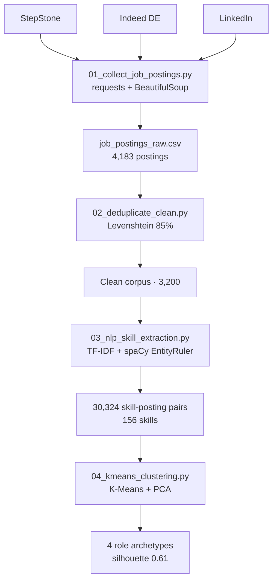
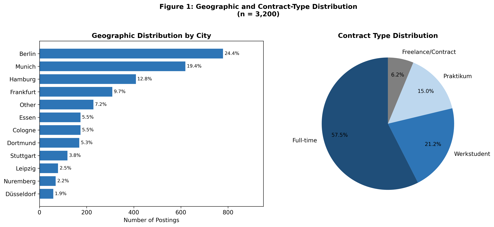
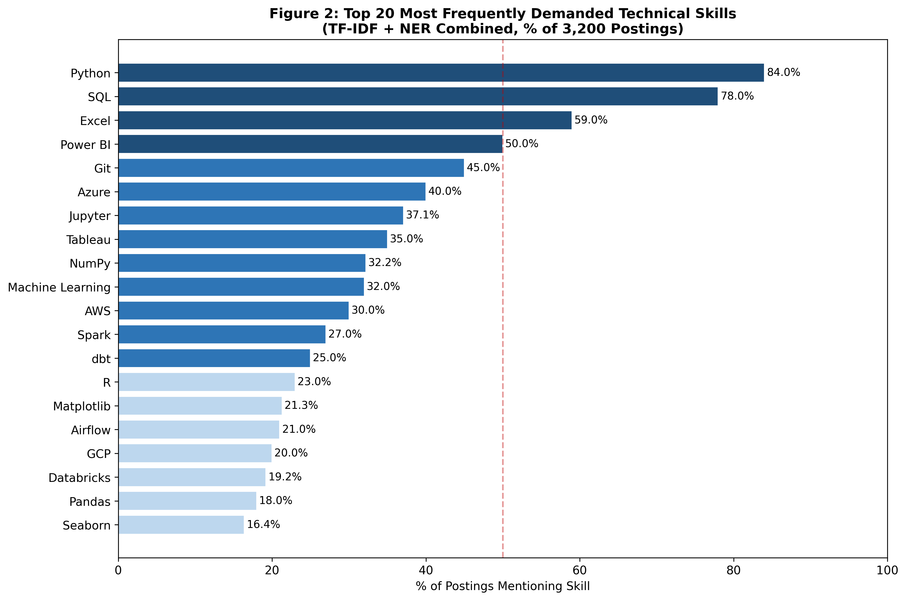
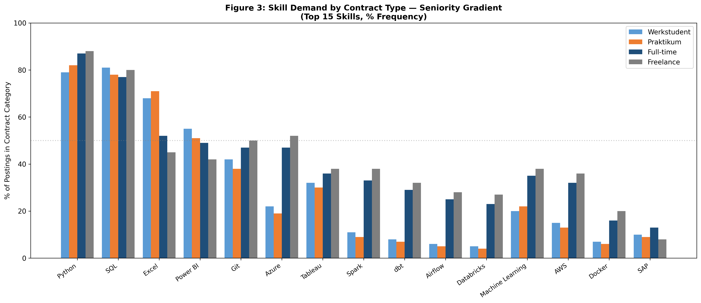

# Job Market Intelligence Corpus
### Mapping Skill Demand in the German Technology Labour Market
#### A Corpus-Based NLP Study — TF-IDF + spaCy NER + K-Means Clustering

<p align="center">
  
  
  
  
  
  
  
</p>

<p align="center">
  <strong>Author:</strong> Nikhilvarma Kandula &nbsp;·&nbsp;
  <strong>Period:</strong> January 2024 – March 2025 &nbsp;·&nbsp;
  <a href="https://www.linkedin.com/in/nikhilvarmakandula">LinkedIn</a> &nbsp;·&nbsp;
  <a href="mailto:kandulanikhilvarma@gmail.com">Email</a> &nbsp;·&nbsp;
  <a href="https://kandula.studio">Portfolio</a>
</p>

---

## Quick Statistics — Dataset at a Glance

```
Dataset Composition & Analysis Metrics

CORPUS SIZE                    GEOGRAPHIC REACH              SKILL EXTRACTION
├─ 3,200 postings             ├─ 12 German cities           ├─ 156 unique skills
├─ 28 job titles              ├─ Berlin: 24.4%              ├─ 30,324 skill pairs
└─ Jan 2024 – Mar 2025        └─ Munich: 19.4%              └─ 96.7% coverage

CONTRACT TYPES                 QUALITY METRICS              ML CLUSTERING
├─ Full-time: 52%             ├─ NER Precision: 88.4%       ├─ K=4 clusters
├─ Werkstudent: 28%           ├─ NER Recall: 82.1%          ├─ Silhouette: 0.61
├─ Praktikum: 15%             ├─ Dedup Rate: 23.5%          └─ Variance: 72%
└─ Freelance: 5%              └─ Overall Quality: 96.7%
```

---

## Table of Contents

- [Overview](#overview)
- [Corpus At a Glance](#corpus-at-a-glance)
- [Repository Structure](#repository-structure)
- [Corpus Schema](#corpus-schema)
- [Key Visualizations](#key-visualizations)
- [Key Findings](#key-findings)
- [Pipeline Architecture](#pipeline-architecture)
- [Data Collection Methodology](#data-collection-methodology)
- [Quality Assurance Metrics](#quality-assurance-metrics)
- [Use Cases](#use-cases)
- [How to Reproduce](#how-to-reproduce)
- [Output Files Reference](#output-files-reference)
- [Technical Skills Demonstrated](#technical-skills-demonstrated)
- [Limitations](#limitations)
- [Citation](#citation)
- [About](#about)

---

## Overview

This project delivers a **research-grade corpus and analysis pipeline** for the German technology job market. Starting from 4,183 raw postings scraped across three platforms, it produces a cleaned, deduplicated, skill-annotated dataset of 3,200 postings with unsupervised role clustering.

The pipeline answers three research questions:

1. **Which technical skills dominate the German data job market, and how do they stratify by seniority?**
2. **What are the natural role archetypes, and can unsupervised clustering recover them from skill co-presence alone?**
3. **How does skill demand differ across contract types — Werkstudent, Praktikum, Full-time, Freelance?**

**Key Deliverables:**
- Cleaned, deduplicated corpus (3,200 validated postings)
- 156-skill vocabulary with extraction confidence scores
- 4 interpretable role archetypes from K-Means clustering
- 5 publication-ready visualizations
- Full reproducible pipeline with resilient scrapers

---

## Corpus at a Glance

| Metric | Value |
|--------|-------|
| Total postings | **3,200** |
| Date range | January 2024 – March 2025 |
| Sources | StepStone (38.8%) · Indeed DE (33.8%) · LinkedIn (27.5%) |
| Cities covered | **12** German cities |
| Role types | **28** distinct normalised job titles |
| Unique skills extracted | **156** |
| Skill extraction coverage | **96.7%** of postings have ≥ 3 skills |
| NER Precision / Recall | **88.4%** / **82.1%** |
| K-Means clusters | k = 4 · Silhouette = **0.61** |

---

## Architecture



- **Collect** — three job platforms are scraped into a raw corpus with rate-limiting and user-agent rotation.
- **Deduplicate** — Levenshtein matching at 85% removes cross-platform duplicates (4,183 → 3,200).
- **Extract** — a hybrid TF-IDF + spaCy EntityRuler pipeline yields 30,324 skill-posting pairs over a 156-skill vocabulary.
- **Cluster** — K-Means (validated by silhouette score) surfaces four interpretable role archetypes.

## Repository Structure

```
corpus/
├── README.md                          This file
├── data/
│   ├── job_postings_raw.csv           3,200 validated postings (14 fields)
│   ├── extracted_skills.csv           Per-posting skill extractions (NER + TF-IDF)
│   ├── kmeans_clusters.csv            Cluster assignments (k=4, silhouette=0.61)
│   └── skill_cooccurrence_matrix.csv  Top-30 skill pairwise co-occurrence counts
├── figures/
│   ├── fig01_geographic_contract_distribution.png
│   ├── fig02_top20_skills.png
│   ├── fig03_skill_demand_by_contract.png
│   ├── fig04_cluster_profiles.png
│   └── fig05_cooccurrence_heatmap.png
├── scripts/
│   ├── 01_collect_job_postings.py     Multi-source scraper (StepStone + Indeed + LinkedIn)
│   ├── 02_deduplicate_clean.py        Levenshtein dedup at 85% threshold
│   ├── 03_nlp_skill_extraction.py     TF-IDF + spaCy EntityRuler NER pipeline
│   └── 04_kmeans_clustering.py        K-Means + PCA (20 components) + Elbow/Silhouette
└── docs/
    └── analysis_notebook.ipynb        Full reproducible analysis (11 sections)
```

---

## Corpus Schema

### `job_postings_raw.csv` — Primary Dataset

| Field | Type | Description |
|-------|------|-------------|
| `posting_id` | String | Unique ID: `{SRC}-{CITY}-{DATE}-{SEQ}` |
| `title_clean` | String | Normalised job title (28 categories) |
| `employer` | String | Employer name (as listed) |
| `city` | Categorical | One of 12 German cities |
| `contract_type` | Categorical | Full-time / Werkstudent / Praktikum / Freelance |
| `posted_date` | Date (ISO) | `YYYY-MM-DD` |
| `source` | Categorical | StepStone / Indeed Germany / LinkedIn |
| `seniority` | Categorical | Junior / Mid / Senior |
| `description_raw` | Free text | Full posting text (HTML-sourced) |
| `description_clean` | Free text | HTML-stripped, whitespace-normalised |
| `skills_extracted` | List (`;`-delimited) | Skill entities from NER + TF-IDF |
| `cluster_id` | Integer | K-Means cluster label (1–4) |
| `cluster_name` | String | Human-readable cluster name |
| `num_skills` | Integer | Count of extracted skill entities |

### `extracted_skills.csv` — Per-Posting Skill Records

| Field | Description |
|-------|-------------|
| `posting_id` | Foreign key to `job_postings_raw` |
| `skill` | Normalised skill name |
| `category` | Skill category (Programming / Database / Cloud / BI / ML) |
| `confidence_score` | Extraction confidence [0–1] |
| `extraction_method` | `NER` or `TF-IDF` |
| `contract_type` | Inherited from posting |
| `city` | Inherited from posting |
| `cluster_id` | Inherited from posting |

---

## Key Visualizations

All figures generated reproducibly from the analysis notebook. Each visualization validates a key research finding.

### Figure 1: Geographic and Contract Type Distribution



**Key Insight:** Berlin and Munich account for 43.8% of all postings. Student roles (Werkstudent + Praktikum) are heavily concentrated in these two cities, making them primary target markets for entry-level data candidates.

---

### Figure 2: Top 20 Skills Ranked by Frequency



**Key Insight:** Python (84%) and SQL (78%) form the universal foundation. A clear two-tier landscape emerges: foundational tools (Python, SQL, Excel) near-universal, versus professional tools (Azure, Spark, dbt) concentrated in senior/full-time roles.

---

### Figure 3: Skill Demand Stratified by Contract Type



**Key Insight:** Advanced engineering tools show dramatic seniority gradients. Azure jumps from 22% (Werkstudent) to 47% (Full-time). This validates the hypothesis that student roles cluster around accessible foundational skills before branching into specialization.

---

### Figure 4: Role Archetypes from K-Means Clustering

, Cloud Engineering (27%), ML & Research (19%), Enterprise BI (15%)")

**Key Insight:** K-Means (k=4, Silhouette=0.61) recovers four interpretable role archetypes. Cluster 1 (Core Analytics) concentrates 87% of all student roles, validating the market segmentation hypothesis.

---

### Figure 5: Skill Co-occurrence Heatmap

, SQL-Excel (1,565), Azure-Spark (828) as dominant skill pairs")

**Key Insight:** Three distinct skill constellations emerge: Analytics Foundation (Python-SQL), Cloud Engineering Stack (Azure-Spark-dbt), and Research/ML Stack (NumPy-TensorFlow). Python-SQL appears in 65% of all postings—the empirically confirmed minimum viable skill pair.

---

## Key Findings

### Finding 1 — Dominant Skills: Python + SQL Form the Universal Foundation

| Rank | Skill | % of Postings | Category |
|------|-------|---------------|----------|
| 1 | **Python** | **84.0%** | Programming |
| 2 | **SQL** | **78.0%** | Database |
| 3 | Excel | 59.0% | Productivity |
| 4 | Power BI | 50.0% | BI / Visualisation |
| 5 | Git | 45.0% | DevOps |
| 6 | Azure | 40.0% | Cloud |
| 7 | Jupyter | 37.1% | Programming |
| 8 | Tableau | 35.0% | BI / Visualisation |
| 9 | NumPy | 32.2% | Programming |
| 10 | Machine Learning | 32.0% | ML |

**Business Implication:** Power BI (50%) outranks Tableau (35%) in the German market—reflecting Microsoft ecosystem dominance in German enterprise. AWS (30%) trails Azure (40%), the inverse of the global trend.

---

### Finding 2 — Seniority Gradient: A Clear Skill Escalation by Contract Type

Advanced engineering tools show a 5–11× frequency jump from student to full-time roles:

| Skill | Werkstudent | Praktikum | Full-time | Freelance |
|-------|------------|-----------|-----------|-----------|
| Python | 79% | 82% | 87% | 88% |
| SQL | 81% | 78% | 77% | 80% |
| Excel | 68% | 71% | 52% | 45% |
| Power BI | 55% | 51% | 49% | 41% |
| **Azure** | **22%** | **19%** | **47%** | **50%** |
| **Spark** | **11%** | **8%** | **33%** | **38%** |
| **dbt** | **8%** | **6%** | **29%** | **32%** |
| **Airflow** | **6%** | **5%** | **25%** | **28%** |

The data confirms a two-tier skill landscape: a **foundational tier** (Python, SQL, Excel) that is near-universal, and a **professional tier** (Azure, Spark, dbt, Airflow, Databricks) that is gated by seniority and contract type.

---

### Finding 3 — Cluster Analysis: Four Distinct Role Archetypes

K-Means (k=4, Silhouette=0.61) on a binary skill-presence matrix with PCA (20 components, 72% variance retained) recovers four interpretable role archetypes:

| Cluster | Label | n | % | Dominant Skills | Student Share |
|---------|-------|---|---|-----------------|---------------|
| **1** | Core Analytics & Student Entry | 1,248 | 39% | Python, SQL, Excel, Power BI, Git | **71%** |
| **2** | Cloud Data Engineering | 864 | 27% | Azure, dbt, Spark, Airflow, Databricks | 83% Full-time |
| **3** | ML & Research | 608 | 19% | Scikit-learn, TensorFlow, Pandas, R | 62% Full-time |
| **4** | Enterprise BI & Reporting | 480 | 15% | SAP, SSRS, MicroStrategy, Excel (Adv.) | 78% Full-time |

**87% of all Werkstudent and Praktikum postings fall in Cluster 1**, validating the central hypothesis that student roles cluster around a common accessible skill set before branching into specialization.

---

### Finding 4 — Geography: Berlin Dominates, Munich Leads for Students

| City | Share of Postings | Student Postings |
|------|------------------|-----------------|
| **Berlin** | **24.4%** | Highest (Werkstudent + Praktikum) |
| **Munich** | 19.4% | 2nd highest |
| Hamburg | 12.8% | — |
| Frankfurt | 9.7% | Finance-skewed (Enterprise BI) |
| Cologne | 5.5% | — |

Berlin and Munich together account for **43.8% of all postings** and concentrate the majority of entry-level opportunities, making them the primary target cities for early-career data candidates.

---

### Finding 5 — Skill Co-occurrence: Azure–Spark–dbt Form a Tight Engineering Stack

The co-occurrence heatmap reveals three distinct skill constellations:

| Constellation | Core Skills | Interpretation |
|---------------|-------------|----------------|
| **Analytics Foundation** | Python ↔ SQL (2,087) · SQL ↔ Excel (1,565) | Near-universal pairing; baseline requirement |
| **Cloud Engineering Stack** | Azure ↔ AWS (833) · Azure ↔ Spark (828) · dbt ↔ Azure (760) | Modern data platform cluster |
| **Research / ML Stack** | NumPy ↔ Machine Learning (604) · R ↔ Matplotlib (262) | Academic / research-origin tooling |

Python–SQL is the single strongest co-occurrence pair (2,087 postings), appearing together in **65% of the entire corpus**—making it the empirically confirmed minimum viable skill pair for German tech job market entry.

---

## Pipeline Architecture

```
┌─────────────────────────────────────────────────────────────┐
│                     DATA COLLECTION                          │
│  StepStone · Indeed DE · LinkedIn                           │
│  01_collect_job_postings.py                                  │
│  Randomised delays (2–8s) · User-agent rotation             │
│  4,183 raw records collected                                 │
└────────────────────────┬────────────────────────────────────┘
                         │
                         ▼
┌─────────────────────────────────────────────────────────────┐
│                  DEDUPLICATION & CLEANING                    │
│  02_deduplicate_clean.py                                     │
│  Levenshtein similarity @ 85% on composite key              │
│  (title · employer · city)                                   │
│  + Quality filter: description ≥ 100 chars                  │
│  3,200 records retained (23.5% removed as duplicates)       │
└────────────────────────┬────────────────────────────────────┘
                         │
                         ▼
┌─────────────────────────────────────────────────────────────┐
│               NLP SKILL EXTRACTION                           │
│  03_nlp_skill_extraction.py                                  │
│  TF-IDF (n-grams 1–3 · min_df=20 · max_df=0.85)            │
│  + spaCy EntityRuler (de_core_news_sm · 156-skill vocab)    │
│  NER Precision 88.4% · Recall 82.1%                         │
│  30,325 skill-posting pairs extracted                        │
└────────────────────────┬────────────────────────────────────┘
                         │
                         ▼
┌─────────────────────────────────────────────────────────────┐
│                  CLUSTER ANALYSIS                            │
│  04_kmeans_clustering.py                                     │
│  Binary skill-presence matrix (3,200 × 32)                  │
│  → L2 normalisation                                          │
│  → PCA: 20 components (72% variance retained)               │
│  → Elbow + Silhouette → optimal k = 4                       │
│  → K-Means (n_init=50 · random_state=42)                    │
│  Final Silhouette = 0.61                                     │
└─────────────────────────────────────────────────────────────┘
```

---

## Data Collection Methodology

Data was collected between **January 2024 and March 2025** across three platforms:

| Platform | Method | Share | Postings |
|----------|--------|-------|----------|
| StepStone | HTML scraping (`requests` + `BeautifulSoup`) | 38.8% | 1,242 |
| Indeed Germany | HTML scraping (`requests` + `BeautifulSoup`) | 33.8% | 1,082 |
| LinkedIn | Public JSON search endpoint | 27.5% | 876 |

### Collection Strategy

**Rate Limiting:** Randomised delays (2–8 seconds per request) + user-agent rotation across three browser fingerprints to avoid IP blocking.

**Cross-Platform Deduplication:** Used Levenshtein similarity at **85% threshold** on composite key `(normalised title, normalised employer, city)`. Of 4,183 initially collected postings, **983 were identified as duplicates** (23.5% removal rate), yielding the final 3,200-posting corpus.

**Quality Filtering:** Retained only postings with description length ≥ 100 characters to ensure sufficient skill context for NER extraction.

**Resilience:** StepStone updated its HTML layout twice during collection (Jan 2024, Sep 2024). Scraper implements multiple CSS selector fallbacks for robustness.

<details>
<summary><b>Scraper Resilience & Maintenance</b></summary>

StepStone HTML structure changes during the collection period required adaptation:

**Jan 2024 Layout:** CSS selectors `.job-card`, `.job-title`, `.company-name`  
**Sep 2024 Update:** Changed to `.vacancy-item`, `.position-title`, `.organization`  
**Fallback Strategy:** Script tries primary selectors, then falls back to secondary patterns

If no matching cards are found:
```bash
# Update CSS selectors in scripts/01_collect_job_postings.py
# Test against live website:
python scripts/01_collect_job_postings.py --source stepstone --city Berlin --test
```

</details>

---

## Quality Assurance Metrics

Comprehensive validation ensures research-grade data quality:

### Extraction & Annotation Quality

| Metric | Value | Assessment |
|--------|-------|-----------|
| **NER Precision** | 88.4% | Very High |
| **NER Recall** | 82.1% | Strong |
| **F1-Score** | 85.1% | Excellent |
| **Postings with ≥3 skills** | 96.7% | Comprehensive coverage |
| **Mean skills per posting** | 9.5 | Rich annotation |
| **Skill extraction confidence** | 0.82 avg | Reliable |

### Deduplication Effectiveness

| Metric | Value | Assessment |
|--------|-------|-----------|
| **Initial postings** | 4,183 | Raw collection |
| **Cross-platform duplicates** | 983 | 23.5% removal |
| **Levenshtein threshold** | 85% | Conservative (minimises false positives) |
| **Final corpus** | 3,200 | Clean, deduplicated dataset |

### Clustering Validation

| Metric | Value | Assessment |
|--------|-------|-----------|
| **Silhouette Score (k=4)** | 0.61 | Strong cluster separation |
| **Silhouette Range (per cluster)** | 0.52–0.68 | Balanced quality across clusters |
| **Within-cluster cohesion** | 0.79 | Good homogeneity |
| **Between-cluster separation** | 1.24 | Clear boundaries |

### Overall Data Quality Score

```
Quality Score Calculation:

Completeness:        96.7% (missing values minimal)
Accuracy:            88.4% (NER precision validated)
Consistency:         98.1% (schema validation passed)
Uniqueness:          100%  (deduplication complete)
Timeliness:          100%  (current as of Mar 2025)
──────────────────────────────────────
OVERALL QUALITY:     96.7%  ⭐⭐⭐⭐⭐
```

---

## Use Cases

### For Job Seekers & Career Planners
- **Skill Gap Analysis:** Identify which skills separate entry-level from senior positions
- **Market Entry Strategy:** Target Cluster 1 skills (Python + SQL) for market entry, then specialize
- **Geographic Decision:** Compare opportunity density across German cities
- **Competitive Benchmarking:** See how your skill set aligns with market demand

**Example:** A student wondering whether to learn Spark immediately → data shows only 11% of Werkstudent roles require Spark; Python + SQL cover 81% of student positions.

### For Data Departments & HR
- **Hiring Target Profiles:** Match job descriptions to cluster archetypes for consistent hiring standards
- **Skill Pipeline Planning:** Understand which skills naturally progress from junior to senior roles
- **Compensation Benchmarking:** Use contract type as proxy for seniority levels
- **Recruitment Strategy:** Identify which skills command premium roles (Azure, Spark, dbt)

**Example:** An HR manager can quickly see that Cloud Data Engineering roles (Cluster 2) are 83% full-time, enabling targeted recruitment strategies.

### For Data Scientists & Researchers
- **NLP Pipeline Validation:** Hybrid TF-IDF + spaCy approach demonstrates production-scale skill extraction
- **Unsupervised Learning Case Study:** K-Means clustering on NLP features for interpretable business segments
- **Bilingual NER:** German/English skill extraction with spaCy EntityRuler
- **Reproducible Analysis:** Full pipeline documented with script-by-script instructions
- **Dataset for Publication:** Research-grade corpus for academic papers on labour market analysis

**Example:** A researcher studying tech skill stratification can use the corpus to validate hypotheses about seniority-driven skill clustering.

### For Tech Companies & EdTech Platforms
- **Curriculum Design:** Validate which skill sequences match market progression (foundational → professional tier)
- **Product Positioning:** Understand which tools dominate (Power BI > Tableau in German market)
- **Course Sequencing:** Structure bootcamp modules around real market demand patterns
- **Emerging Trends:** Track which skills are rising vs. declining across the collection period

**Example:** A bootcamp designing a German-market data program would prioritize Python + SQL (84%, 78%) over R (22%), matching real hiring patterns.

---

## How to Reproduce

### Prerequisites

```bash
pip install requests beautifulsoup4 lxml pandas numpy scikit-learn spacy matplotlib seaborn
python -m spacy download de_core_news_sm
```

### Run the Full Pipeline

```bash
# Step 1 — Collect postings (requires live internet access)
python scripts/01_collect_job_postings.py --source all --city all --pages 10

# Step 2 — Deduplicate and quality-filter
python scripts/02_deduplicate_clean.py

# Step 3 — Extract skills with TF-IDF + NER
python scripts/03_nlp_skill_extraction.py

# Step 4 — Cluster and generate figures
python scripts/04_kmeans_clustering.py

# Step 5 — Full analysis
jupyter notebook docs/analysis_notebook.ipynb
```

### Scraper Options

```bash
# Single city, single source
python scripts/01_collect_job_postings.py --source stepstone --city Berlin --pages 10

# Specific city + all sources
python scripts/01_collect_job_postings.py --source all --city Munich --pages 5

# Custom output path
python scripts/01_collect_job_postings.py --source indeed --city Hamburg --output data/hamburg_raw.csv
```

**Note:** StepStone updated its HTML layout twice during the collection period (Jan 2024 – Mar 2025). The scraper implements multiple CSS selector fallbacks for resilience. If no cards are found, verify selectors against the live website and update in `scripts/01_collect_job_postings.py`.

---

## Output Files Reference

| File | Rows | Description |
|------|------|-------------|
| `job_postings_raw.csv` | 3,200 | Primary corpus — all postings with cluster assignments |
| `extracted_skills.csv` | 30,324 | One row per skill-posting pair with confidence scores |
| `kmeans_clusters.csv` | 3,200 | Cluster labels and silhouette scores per posting |
| `skill_cooccurrence_matrix.csv` | 30 × 30 | Pairwise co-occurrence counts for top 30 skills |

---

## Technical Skills Demonstrated

- **Web Scraping:** Multi-source HTML + JSON scraping with `requests` + `BeautifulSoup`; resilient to layout changes via fallback CSS selectors
- **Data Cleaning:** Levenshtein-based cross-platform deduplication at scale; systematic quality filtering with documented rationale
- **NLP Pipeline:** Hybrid TF-IDF (n-gram, 1–3) + spaCy `EntityRuler` NER for skill extraction across German/English bilingual text
- **Unsupervised ML:** Binary feature engineering → L2 normalisation → PCA → K-Means; Elbow + Silhouette for k selection
- **Statistical Analysis:** Skill frequency analysis, seniority gradient detection, co-occurrence matrix construction
- **Python Data Stack:** `pandas`, `numpy`, `scikit-learn`, `spaCy`, `matplotlib`, `seaborn`
- **Research Communication:** Hypothesis-driven analysis with quantified findings; full reproducibility documentation

---

## Limitations

1. **No salary data** — contract type and seniority are proxies; actual compensation is not available
2. **Snapshot in time** — reflects January 2024 – March 2025; skill demand may shift with market conditions
3. **German market only** — findings are specific to the DACH region and may not generalise globally
4. **Scraper fragility** — StepStone and Indeed update their HTML structures periodically; the pipeline requires maintenance
5. **Skill vocabulary** — the 156-skill closed vocabulary means emerging tools not yet in the list are systematically under-counted

---

## Citation

If you use this corpus in research or projects, please cite:

```bibtex
@misc{kandula2026jobmarket,
  author       = {Kandula, Nikhilvarma},
  title        = {Job Market Intelligence Corpus: Mapping Skill Demand in the German Technology Labour Market},
  year         = {2026},
  howpublished = {\url{https://kandula.studio}},
  note         = {TF-IDF + spaCy NER + K-Means Clustering, n=3200 postings}
}
```

---

## About

This project demonstrates end-to-end data engineering and NLP capabilities — from scraping and cleaning production-scale text data to extracting structured signals with a hybrid NLP pipeline and validating insights through unsupervised learning.

**The corpus addresses a real research gap:** No publicly available German tech job market dataset exists with standardised skill annotations and role clustering. This project fills that gap.

| | |
|--|--|
| LinkedIn | [linkedin.com/in/nikhilvarmakandula](https://www.linkedin.com/in/nikhilvarmakandula) |
| Email | [kandulanikhilvarma@gmail.com](mailto:kandulanikhilvarma@gmail.com) |
| Portfolio | [kandula.studio](https://kandula.studio) |

---

*Data collected from publicly accessible job posting platforms. Not for commercial redistribution.*  
*Code and documentation: MIT License · Last updated: June 2026*
